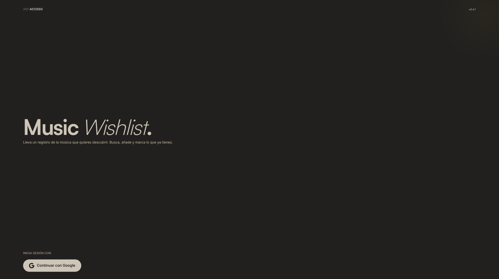

# MusicWishlistV2



A music wishlist app built with Angular 20 that lets you search for tracks and albums via Deezer, save them to a personal wishlist, and track their download status.

## Tech Stack

- **Frontend**: Angular 20 with signals, standalone components, OnPush change detection
- **Styling**: Tailwind CSS with custom design tokens
- **Backend**: Firebase (Auth + Firestore) + Vercel serverless API functions
- **Search**: Deezer API (proxied via Vercel serverless functions)
- **Deployment**: Vercel

## Features

- **Search**: Search tracks and albums via Deezer API
- **Wishlist**: Add/remove items, mark as downloaded, filter by status
- **Releases**: View new releases from favorite artists
- **Profile**: Account settings, language, theme (light/dark/system)
- **Share**: Share wishlists with other users via invite links
- **Demo Mode**: Test the UI without Firebase auth using `?demo` query param
- **i18n**: Spanish and English translations

## Demo Mode

Visit `http://localhost:4200/?demo` to try the app without a Google account:

- Username: `demo`
- Password: `1234`

## Getting Started

### Prerequisites

- Node.js 20+
- npm 10+

### Installation

```bash
npm install
```

### Development Server

```bash
npm start
```

Open `http://localhost:4200/`

### Build

```bash
npm run build
```

Output: `dist/music-wishlist-v2/browser/`

### Tests

```bash
npm test
```

Run a single test file:

```bash
ng test --include='**/wishlist.service.spec.ts'
```

## Project Structure

```
src/app/
├── core/
│   ├── api/          # Deezer search integration
│   ├── auth/         # Firebase Auth + mock auth
│   ├── config/      # App configuration (demo mode)
│   ├── firebase/    # Firestore services (wishlist, favorites, invites)
│   ├── guards/      # Route guards
│   ├── i18n/        # Translations (ES/EN)
│   └── theme/       # Theme switching
├── features/
│   ├── login/       # Authentication
│   ├── profile/     # User settings
│   ├── releases/    # New releases from favorites
│   ├── search/      # Deezer search
│   └── wishlist/    # Personal wishlist
├── layout/          # Header, tab bar
└── shared/
    ├── components/  # Reusable UI components
    ├── icons/       # SVG icon system
    └── models/      # TypeScript interfaces
```

## Deployment

The app deploys automatically to Vercel via the included `vercel.json` configuration. API endpoints are deployed as serverless functions.

## License

MIT